# R-Note

> - 项目依赖 [qwindowkit](https://github.com/stdware/qwindowkit)，若要进行前端开发，请使用 `--recursive`克隆项目
> - `git clone --recursive https://github.com/RIPTIDE-z/R-Note.git`

## 1. 项目说明

- 实践分布式事务控制的项目
  - 后端使用 `Spring Boot` + `Druid` + `MyBatis` + `Atomikos` + `MySQL`
  - 前端使用 `Qt Widgets` + `qwindowkit`框架(windows无边框) + `md4c`(markdown语法解析)
  - 使用 `RESTful API`标准、`APIfox`软件辅助设计接口
- 项目整体为带有简单 **用户注册/登录**，笔记 **编辑** **历史查看/回滚** 的代码笔记软件

---

### 1.1 数据库配置说明

1. 服务端需要安装MySQL创建 `auth_db` `note_db`两个数据库并创建管理员用户(开发环境也可全使用root进行测试)
   - 创建脚本位于 [sql脚本](./Note_back/src/main/resources/sql)
   - 在root运行 `auth_db_init.sql`  `note_db_init.sql`
   - 在root运行 `admin_init.sql`，注意 **配置自己的密码**
     ```sql
     CREATE USER IF NOT EXISTS 'auth_admin'@'localhost'
         IDENTIFIED BY '你的密码';

     CREATE USER IF NOT EXISTS 'note_admin'@'localhost'
         IDENTIFIED BY '你的密码';
     ```
2. 数据库连接所需用户密码配置方式为 `application.yml` 引入 `db_credential.yml` 文件，具体信息均在其中配置
   - 请自行根据 `db_credential_example.yml` 创建 `db_credential.yml` 并填写信息

     ```yml
     spring:
       config:
           import: "classpath:db_credential.yml"
     ```

     ```yml
     auth_db:
       username:
       password:

     note_db:
       username:
       password:
     ```

---

### 1.2 前端开发说明

- 项目开发使用 `Qt 6.9.3` `VS`+ `Cmake`构建 + `MSVC`工具链 ，请尽量保证环境一致
- 构建预设位于 `CMakePresets.json`，默认使用 `Ninja`
  - 使用 `CMakeUserPresets.json`作为用户级配置文件，已给出 `CMakeUserPresets_example.json`示例
    - 在其中的 `QTDIR`中配置你自己Qt库的安装位置，如 `"QTDIR": "D:/Qt/6.9.3/msvc2022_64"`
  - 默认将QWindowkit的库静态编译到程序
    - 使用时配置Qt安装目录到环境变量或者使用 `Windeployqt`部署程序所需的dll文件等(用法略)

---

# 2. 部署说明

## 2.1 后端部署

1. 在 `application.yml`中使用 `optional:file:config/db_credential.yml`
2. 使用 `mvn package ` 打包得到jar包
3. 在所需部署的服务端设备上按照数据库配置配置两个数据库
4. 在jar所在的目录下建立 `config`文件夹并在其中新建 `db_credential.yml`，在其中配置数据库用户信息
5. 运行 `java -jar ./note-backend-0.4.jar`(注意具体的jar包名称)
6. 看到类似以下信息说明启动成功
   ```
   Thanks for using Atomikos! This installation is not registered yet. 
   REGISTER FOR FREE at http://www.atomikos.com/Main/RegisterYourDownload and receive:
   - tips & advice 
   - working demos 
   - access to the full documentation 
   - special exclusive bonus offers not available to others 
   - everything you need to get the most out of using Atomikos!
   ========================================
   ✅ 笔记后端系统启动成功！
   ========================================
   ```
7. 此时可访问 `http://localhost:8080/api/druid/`来访问druid监控界面进一步验证系统运行
   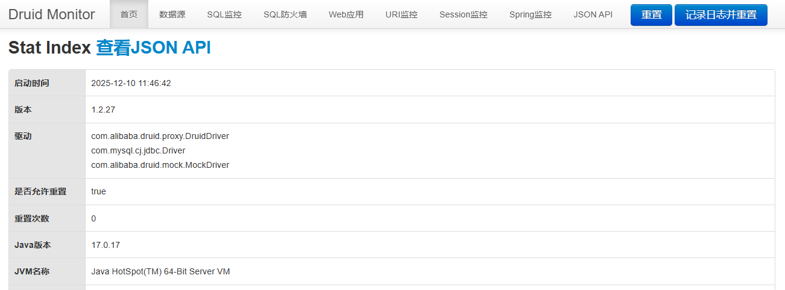
   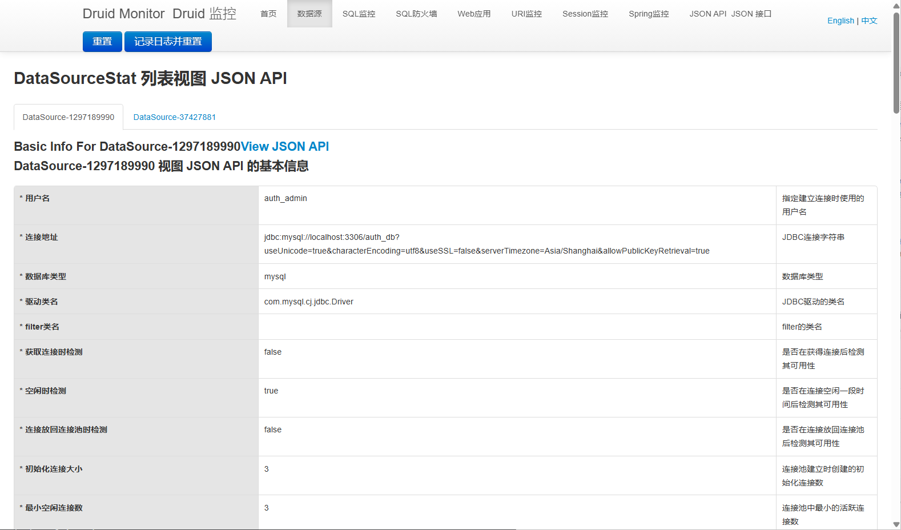
8. 若部署在远端服务器，只需在客户端配置页面设定 `baseurl`为 `http://[你的域名或公网ip]:[你的端口]/api`
   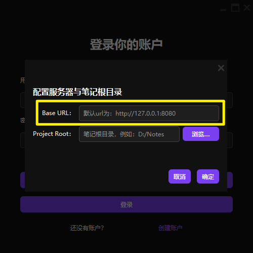

---

## 2.2 前端部署

> 若想打包为windows安装程序，需要下载 [NSIS](https://nsis.sourceforge.io/Main_Page) 进行打包

1. 选定启动项为 `R-Note.exe(安装)`并运行
   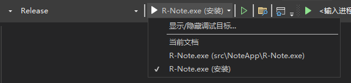
   默认安装目录位于 `bin/Release` 或 `bin/Debug`
2. 若不需要打包为安装包，安装目录下的exe已经可以作为程序使用和分发
3. 若要打包为安装包，则需要运行 [installer.nsi](./Note_front/installer/installer.nsi)
   - `nsi`文件中的 `SOURCE_DIR` 配置项表明了需要打包进安装程序的所有文件的存放目录，默认为 `"..\bin\Release"` ，若想更改打包路径请自行修改
4. 在 `installer`文件夹下运行 `makensis ./installer.nsi`
   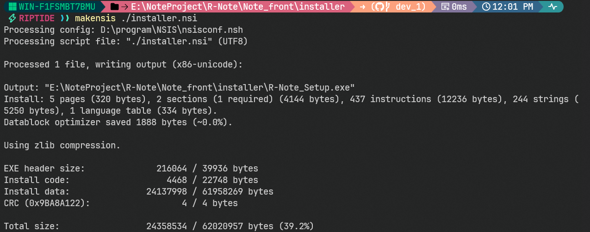
5. 运行成功后生成的 `R-Note_Setup.exe`即为安装程序

---

# 3. 接口测试记录

| 接口                       |   状态   | 记录                                                      |
| -------------------------- | :------: | --------------------------------------------------------- |
| 用户注册                   | 初步验证 | 12.3 初步验证接口可行性                                   |
| 用户登录                   | 初步验证 | 12.3 初步验证接口可行性                                   |
| 用户退出登录               | 初步验证 | 12.3 初步验证接口可行性                                   |
| 获取指定笔记的指定版本内容 | 初步验证 | 12.9 初步验证接口可行性                                   |
| 删除指定笔记               | 初步验证 | 12.10 初步验证接口可行性                                  |
| 获取指定笔记的历史列表     | 初步验证 | 12.9 初步验证接口可行性 |
| 查看指定版本内容           | 初步验证 | 12.9 初步验证接口可行性 |
| 新建/更新/回滚笔记         | 初步验证 | 12.9 初步验证三种功能可行性                               |
| 获取笔记结构               | 初步验证 | 12.6 初步验证接口可行性                                   |
| 更新笔记结构               | 初步验证 | 12.6 初步验证接口可行性                                   |

---

# 4. Release说明

## Release 0.1

- 框架合作的验证程序，实际运行效果类似学生管理系统

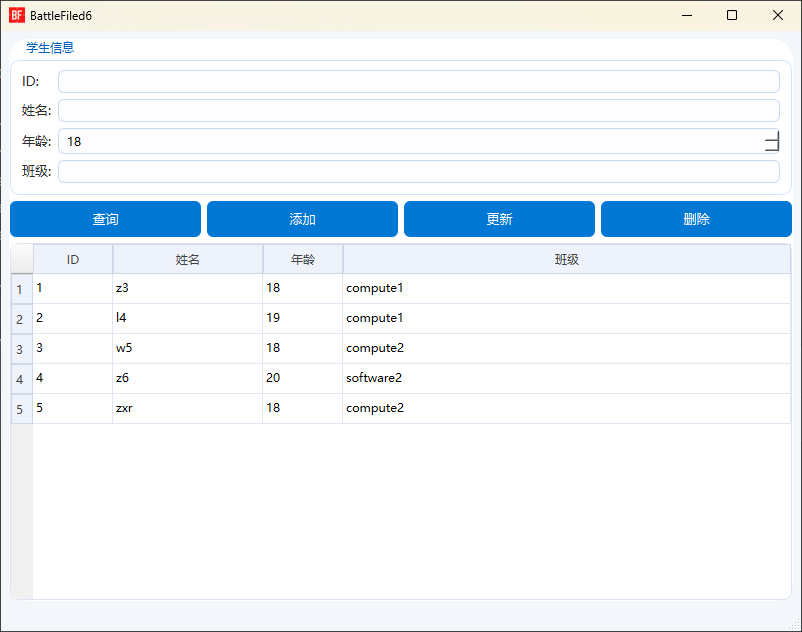

---

## Release 0.2

- 前后端协作的第一个测试版本，验证了注册/登录接口可行性并创建简单前端页面

---

## Release 0.3

- 第二个测试版本

  - 验证了笔记结构的可行性
  - 建立了配置界面，让配置信息可以主动更改
  - 优化数据库建立和管理逻辑，让linux和windows逻辑统一
- `Ubuntu 22.04` 远端服务器测试：
  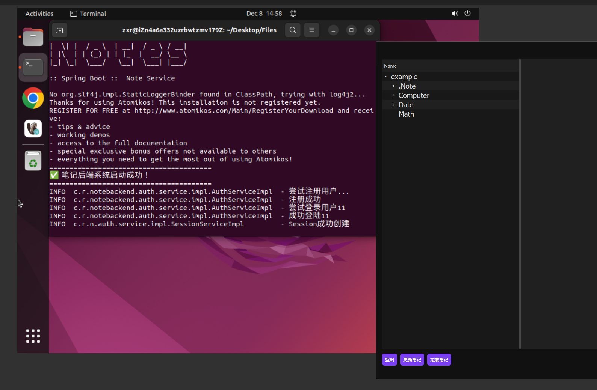

---

## Release 0.4 

- 基本完成所有业务功能，待优化ui以及部分逻辑
- 功能说明如下

1. 登录与注册
    - 首先需要指定远端服务器`url`以及笔记项目根目录
      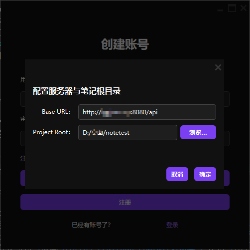
    - 正常注册/登录，会进行简单的用户是否重名检查
      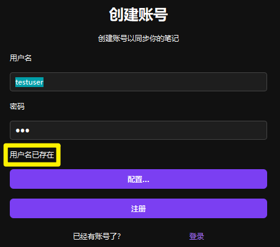
    - 登录后有登出选项
2. 笔记编辑
    - 采用md4c进行简单的markdown语法渲染（暂时无法渲染图片）
        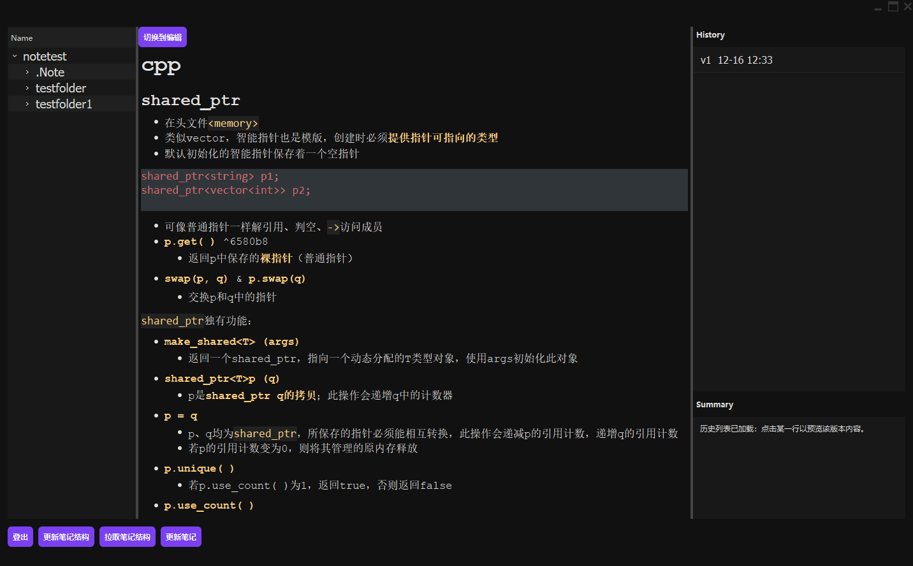
    - 左侧含有项目大纲，可进行简单的新建/删除
        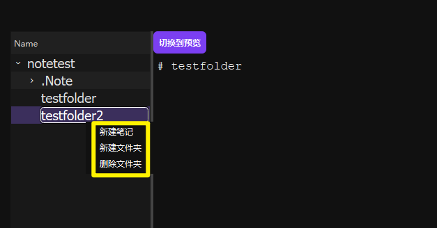
3. 笔记更新
    - 下方功能栏：
        1. 更新笔记结构:上传`note_structure.json`
        2. 拉取笔记结构:拉取远端服务器存储的`note_structure.json`的同时扫描本地文件夹，拉取缺失的文件
            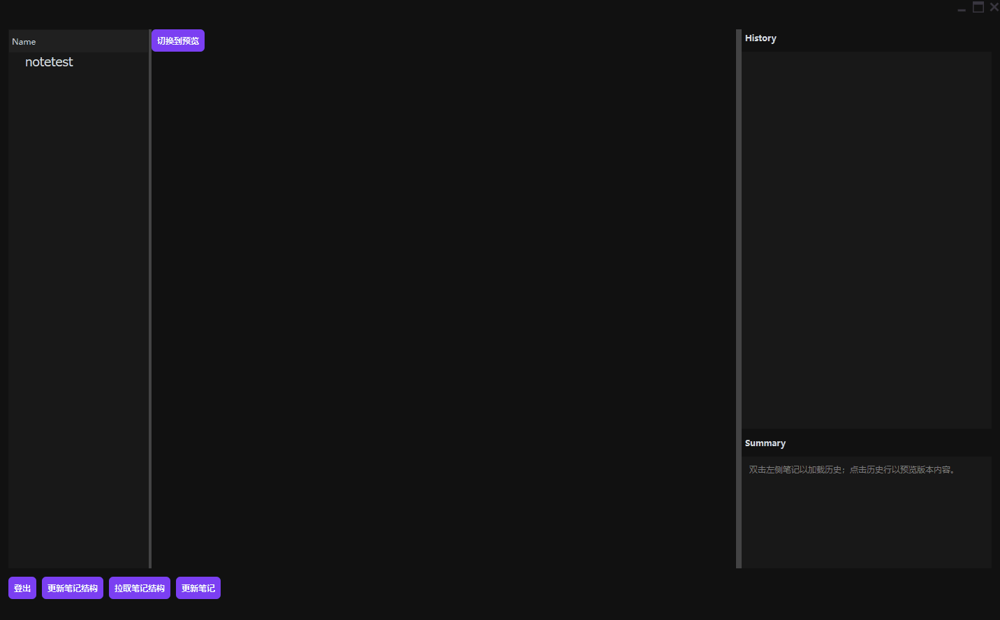
            - 并不检查文件hash值，只检查同名文件是否存在
            - 每次修改笔记或者关闭软件前注意先`更新笔记结构`
        3. 更新笔记:为当前笔记创建新的历史版本，可以简单写`changeSummary`
4. 历史浏览与回滚
    - 右侧功能栏：
        1. 上方显示目前笔记的历史列表，右键可回滚
        2. 下方显示当前历史的changeSummary
        3. 点击具体历史版本后会有预览窗口
            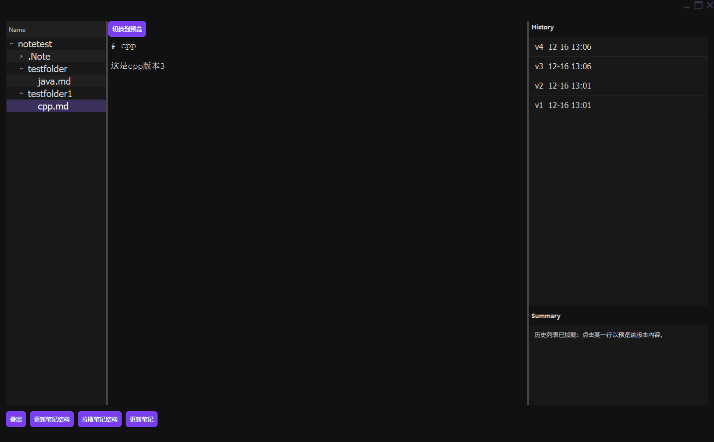

---

# License

- 本项目使用 [MIT License](./LICENSE.md)
- 项目引用 [qwindowkit](https://github.com/stdware/qwindowkit),使用 [Apache 2.0 License](https://github.com/stdware/qwindowkit/blob/main/LICENSE)
- md渲染引用 [md4c](https://github.com/mity/md4c),使用 [MIT License](./Note_front/external/Md4c/LICENSE.md)
